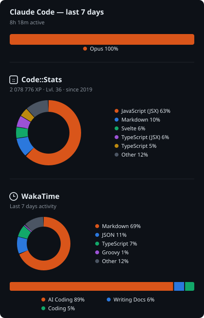

### Hi, I'm Jérôme 👋

**Senior Frontend & Fullstack Engineer · Platform & Architecture**
 
Designer → Fullstack → Architect

I didn't start in code — I started in design, then taught myself to ship whole apps end to end and never stopped widening the stack. Twenty-ish years in, I'm a frontend-first engineer comfortable across the whole thing: React, Next.js, TypeScript and React Native on the front (Svelte/SvelteKit whenever I get the choice), Node, GraphQL and serverless AWS behind it.

The part I care about now isn't shipping one more feature — it's **building the platform other people ship features on**: setting technical direction, smoothing the path for design and product, and keeping systems clean and hard to break.

Outside the day job I build a personal ecosystem for the love of it — a named suite of apps (**Shani**) sharing a UI component library, a typed data layer and a scaffolding tool I wrote to spin up new apps from the canonical setup.

🔭 The clearest picture of how I think about platforms lives on my [ecosystem page](https://portfolio.webzappette.com/ecosystem/).

---

[Portfolio](https://portfolio.webzappette.com/) ·
[LinkedIn](https://www.linkedin.com/in/jeromesoulas/) ·
[WakaTime](https://wakatime.com/@b8bb0b6e-7cc2-43fe-958a-eb92fa6aa446) ·
[Code::Stats](https://codestats.net/users/mate2fr) ·
[CodePen](https://codepen.io/mate2)

Stack: TypeScript · React · Next.js · Svelte/SvelteKit · React Native · Node · GraphQL · Tauri · Electron · AWS · Vercel · Docker · MongoDB · PostgreSQL

---

---

**↓ A few things I'm proud of are pinned below.**